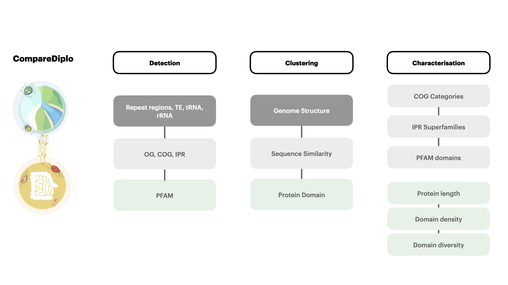

# CompareDiplo: Comparative Genomic Analysis Pipeline for Diplomonads



**CompareDiplo** is a bioinformatics pipeline designed for comparative genomics analysis, particularly focusing on diplomonads. This tool facilitates genome and proteome annotation, protein family clustering, and functional characterization to explore evolutionary trajectories and lifestyle adaptations in free-living and parasitic diplomonads.

## Pipeline Workflow

The **CompareDiplo** pipeline integrates several stages of analysis across genome structure, sequence similarity, and protein domain characterization, designed for flexibility and extensibility in genomic research.

### Workflow Components
1. **Genome and Proteome Labeling**: Initiates with gene enrichment analysis, which aids in effective clustering of protein sequences.
2. **Genome Annotation (using GenoDiplo)**: Core annotation step to define functional labels for specific regions such as transposable elements and repeat regions.
3. **Sequence Similarity Analysis**: Employs tools like Orthofinder, InterProScan, and EggNOG-mapper to categorize protein sequences by homology and Hidden Markov Model (HMM) profiles.
4. **Protein Clustering and Functional Characterization**: 
   - Labels proteins by orthologous groups, InterPro, and KEGG pathways.
   - Focuses on clustering based on InterPro (IPR) domains, including Superfamily and PFAM domains, to identify genomic features and functional significance.

### Key Tools and Dependencies
- **Orthofinder**: For orthologous group detection.
- **InterProScan**: For functional annotation of protein sequences.
- **EggNOG-mapper**: For evolutionary and functional annotation using orthologous groups and HMM profiles.

## Results Interpretation

The CompareDiplo pipeline has been instrumental in:
- Elucidating evolutionary trends between free-living and parasitic diplomonads.
- Demonstrating how expanded protein families correlate with lifestyle adaptations, especially for species in anaerobic environments.
- Revealing new insights into the complexity of protein family expansions in *H. inflata*.

## Installation and Setup

1. Clone the repository:
   ```bash
   git clone https://github.com/username/CompareDiplo.git
   cd CompareDiplo
   ```

2. Install dependencies:
   ```bash
   conda env create -f environment.yml
   conda activate CompareDiplo
   ```

## Output

Results will include:
- Annotated genome and proteome files with functional labels.
- Comparative genomic summaries, focusing on protein family expansions and sequence similarities.
- Visualizations of protein domain diversity across diplomonads.
